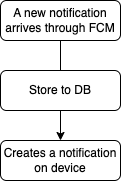
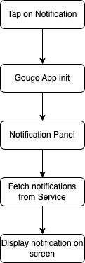
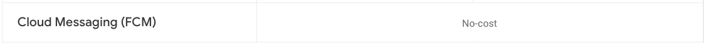

## Notificaciones en Android

Para las notificaciones en Android se hace uso Firebase Cloud Messaging (FCM) el cuál se puede integrar de manera sencilla tanto en BE como en la plataforma.

El flujo de la aplicación sería el siguiente:

#### Case 1


#### Case 2



Lo cual harían necesaria las siguientes tareas:

1. Conexión de la aplicación con Firebase (if approved)
2. Servicio de notificación de Firebase (if approved)
3. Pantalla de lista de notificaciones
4. Pantalla de mostrar detalles de notificación
5. Objeto que se encargue de la persistencia de las notificaciones de forma local (Room) (Creación de modelo, Dao, etc)
6. Conexión con servicio para obtener las nuevas notificaciones y lógica de caching

Por definir:

- ¿cómo se abrirán las imágenes? ¿dentro de la aplicación? ¿será un link a una URL y se visualizará sobre el navegador?
- Los archivos .xlsx ¿dónde se abrirán?

### Firebase

Actualmente el uso de FCM para el envío de notificaciones no tiene costo al día 12 Marzo 2023




## Backend

En el lado del backend se requieren los siguientes endpoints:

### API Endpoints
#### Send Notification

```bash
POST /notifications
```

Create a new notification with the following request body:

```json
{
  "title": "Notification Title",
  "description": "Notification Description",
  "images": [
    "https://example.com/image1.jpg",
    "https://example.com/image2.jpg"
  ],
  "attachments": [
    {
      "url": "https://example.com/file.pdf",
      "name": "file.pdf"
    }
  ],
  "recipients": {
    "users": ["user_id_1", "user_id_2"],
    "groups": ["group_id_1", "group_id_2"]
  }
}
```

The `recipients` field is an object that specifies the users and groups that the notification should be sent to. If the `users` field is provided, the notification will be sent to those specific users. If the `groups` field is provided, a notification will be sent to all users in those groups.

#### Fetch Notifications

```bash
GET /notifications
```


Retrieve a list of all notifications.
#### Fetch Notification by ID

```bash
GET /notifications/{notification_id}
```


Retrieve a single notification by its ID.
#### Update Notification by ID

```bash
PUT /notifications/{notification_id}
```

Update a single notification by its ID with the following request body:

```json
{
  "title": "Updated Notification Title",
  "description": "Updated Notification Description",
  "images": [
    "https://example.com/image3.jpg",
    "https://example.com/image4.jpg"
  ],
  "attachments": [
    {
      "url": "https://example.com/updated-file.pdf",
      "name": "updated-file.pdf"
    }
  ],
  "recipients": {
    "users": ["user_id_3"],
    "groups": ["group_id_1"]
  }
}
```

The `recipients` field can also be updated when updating the notification.

#### Delete Notification by ID

```bash
DELETE /notifications/{notification_id}
```

Delete a single notification by its ID.

### Response Format

All endpoints will return a JSON response with the following format:

```json
{
  "success": true,
  "data": {}
}
```


If there is an error, the response will have the following format:

```json
{
  "success": false,
  "error": {
    "code": "ERROR_CODE",
    "message": "Error message"
  }
}
```


### Retrieve notifications for user

```bash
GET /notifications/user/{user_id}
```
- Path Parameters: 
- `user_id`: the ID of the user whose notifications should be retrieved. 
- Response Body:

```go
{
    "status": "success" | "error",
    "notifications": [
        {
            "id": string,
            "title": string,
            "message": string,
            "timestamp": string
        },
        ...
    ]
}
```

## Web FrontEnd

Para la parte Web se necesitarían al menos las siguientes pantallas:

- Pantalla de redacción de notificaciones
	- Esta debe contener al menos los siguientes campos: 
		-  Destinatarios (usuario o grupos)
		-  Título
		-  Mensaje o cuerpo
		-  Attachments (URL, archivos-imágenes)
- Pantalla de listado de notificaciones
- Pantalla de edificón (misma que redacción)
- Pantalla -rara- (pag 1)

## Dudas

1. Según el wireframe, se envía a gurpo de usuarios pertenecientes a una cadena comercial (pag. 3); los grupos comerciales o grupos en general, estarán ya definidos por un endpoint, al igual que sus usuarios, o se tendrán que generar

